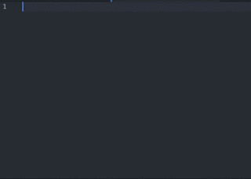
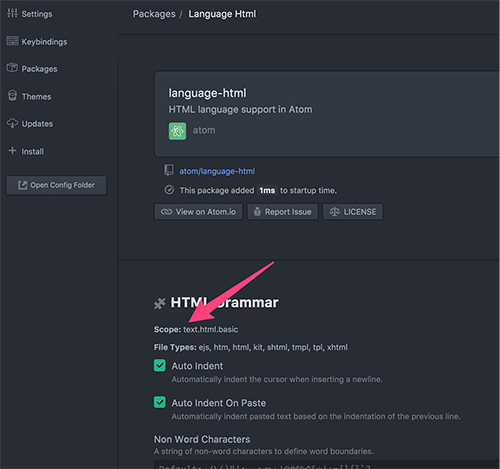

# Atom使用记录

轻量级编辑器从最开始的notepad++到sublime在到现在的Atom。选择Atom的原因就是觉得比sublime漂亮，而且不用忍受sublime每次license的提示。使用了一段时间表示能够忍受它打开项目略慢的体验，喜欢简洁的管理界面，vim扩展还不够完美，比如:宏操作、`ctrl + v`纵向选择、正则等。   
现在常用的工具是:Jetbrains、Terminal、Atom; Atom现在是边用边折腾，目标是常用操作能和Jetbrains高度一致(现在还有很多快捷功能不一样，导致每次都按错键)。于是每次解决一个问题就来此做一下笔记。  
## Snippets代码片段管理   
### 简介
代码片段的简写，输入简写代码按tab键，就补全了一段复杂的代码。这个功能用起来有种飞起来的感觉。    
  
这是Atom默认的功能，在snippet插件包中，Atom默认已经有很多代码片段的简写，我们可以通过快捷键`alt+shift+s`搜索查看当前文件支持的简写,注意所有的简写都是和语言相关联的，例如:`img`这个简写在markdown文件中和在html文件中是不一样的。   
### 自定义
#### 基本配置说明
自定义文件在`~/.Atom/snippets.cson`，也可以通过`shift+cmd+p`(Mac)搜索`Open Your Snippets`打开自定义文件。   
打开后可以看到被注释的示例  
```
# '.source.coffee':
#   'Console log':
#     'prefix': 'log'
#     'body': 'console.log $1'
```
* `.source.coffee`:表示所支持的语言，每一语言的表示都不一样，在Atom里面这个表示被称作为`scope`，比如我们要为html自定义代码片段，我们先要找到html语言的`scope`,在packages里面搜索`langurage-html`，查看详情就可以看到html的`scope`是`.text.html.basic`  
  
* `Console log`:表示的是名称，随便取名  
* `prefix`:表示代码的简写,示例中简写是`log`  
* `body`:表示简写所代表的代码片段,`$1` 表示光标将定位的输入的第`1`个位置，这个值可以定义多个`$1 $2 $3`，也可以不定义    
* 注意缩进，否则会报语法错误   

#### 复杂一点的配置
代码片段比较多，有换行和缩进，可以使用三个双引号`"""`来原样输出。同时支持`\n\r`来换行缩进如:  
```
'ul':
    'prefix': 'ul+'
    'body': """
            <ul>
                <li>$1</li>
            </ul>
            """
```

#### 不完善的地方
相比于Vim和Jetbrains，Atom的snippet插件很有很多不足的地方。   
例如  
* 对符号的支持。不支持`input:text`这种简写有分号和其他符号的形式(支持`-`,`=`)  [vim和jetbrains均支持]
* 不支持有变量的简写。如`div#container`代表`<div id="container"></div>`，这个id是可变的 [仅jetbrains支持]


<div>sdfsd</div>
