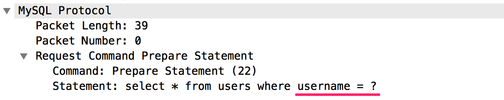
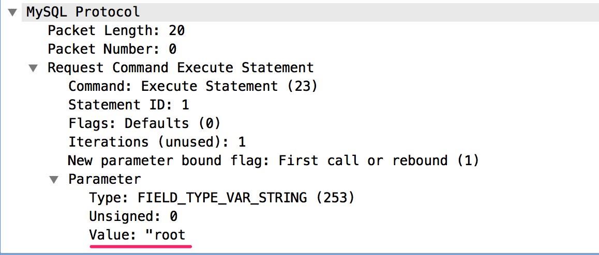
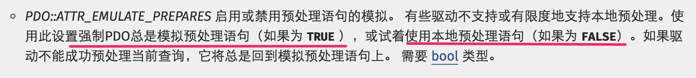
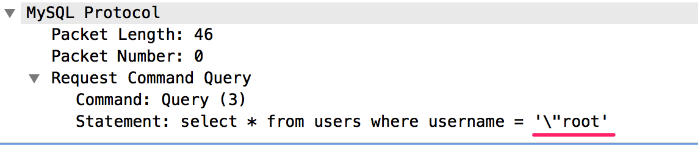
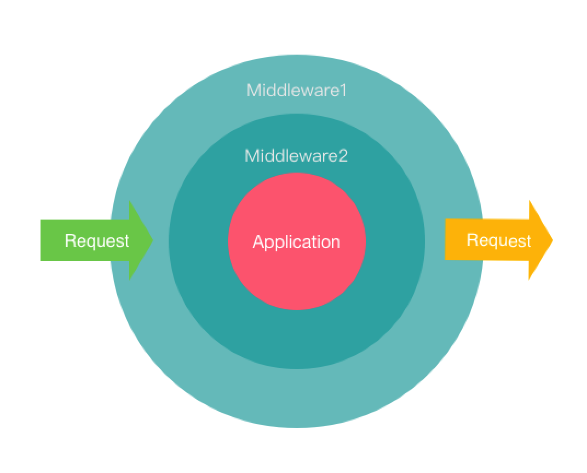

# PHP开发安全防护
PHP作为世界上最好的语😅 ，在WEB开发中应用广泛，同时也经常会产生会各种漏洞，那么我们改怎样有效的防护这些漏洞呢？今天就来讨论下PHP开发安全防护。 
当年PHP还是PHP4这个版本时，多数项目用着混编的模式(前端代码和PHP代码未分离)进行编码、手写拼接SQL语句、`echo`直接输出，这些习惯也被延续到了今天。由于没有良好的工程结构、没有安全意识导致很多老项目漏洞百出，这种项目让开发人员最为头疼。  
作为PHP安全开发的第一步，你需要使用一个优秀的PHP框架。一个优秀的框架不仅有着良好的工程结构，也往往在安全防御上有很多有用的类库、开关。今天介绍的PHP开发安全防护也是基于框架来说的。 
PHP框架数不胜数，很多PHP开发人员都自己写过框架。但优秀常用的PHP框架也就那么几个，如经典的`Codeigniter`、使用优雅的`Laravel`、执行速度最快的`Yaf`等等。  
框架的基本思想大同小异，基本上其核心都是MVC、MVP这几种模式，而我们常见的漏洞也就处在这几层上面，如：Model层造成SQL注入漏洞、Controller层造成逻辑漏洞、View层造成XSS漏洞。  
下面涉及到框架方面的东西都是基于`Laravel`框架进行讨论，其他框架功能也都类似。
### SQL注入防护
SQL注入的造成是因为执行了非预期的SQL语句，而这种情况往往是由于开发图省事，喜欢直接写SQL语句，但又没有对用户输入进行过滤或者过滤不严格造成的。  
解决SQL注入的银弹就是预处理(本文针对MYSQL讨论，其他DB也有预处理特性)，什么是预处理语句？可以把它看作是想要运行的 SQL 的一种编译过的模板，它可以使用变量参数进行定制。预处理语句可以带来两大好处：1、提高运行效率。2、防止SQL注入。  
程序会将一次SQL执行分为两次发送给MySQL，第一次发送预声明SQL语句,形如`select * from users where username = ?`，

第二次发送执行绑定的参数值，如:`root`

由于是将sql语句和值分开发送的，再由MySQL内部执行，这样就不会出现执行非预期的SQL语句情况。预处理可以说是最简单有效的防止SQL注入的方式。  
不过使用预处理方式也是有条件的，PDO中有一个属性`PDO::ATTR_EMULATE_PREPARES`，默认是`true`，它将强制PDO总是模拟预处理语句。

测试一段代码:

```
$pdo = new PDO("mysql:host=127.0.0.1;dbname=system;charset=utf8",'root',"password");
$st = $pdo->prepare("select * from users where username = ?");
$name = '"root';
$st->bindParam(1,$name);
$st->execute();
$st->fetchAll();
```

抓包查看

可以看到并没有使用MySQL预处理的方式，而是进行的转义，那么这个伪预处理的方式可能存在绕过的问题。  

### XSS防护
XSS是很不好防，稍不留神就会产生纰漏。这也就需要我们在开发过程中时刻保持警惕每一个数据的输出是否进行编码。  
XSS分为反射型XSS、存储型XSS、基于DOM的XSS  
其造成的原因分为两块：1、视图没有进行编码直接输出造成(存储型XSS)  2、js对用户输入数据没有进行编码或过滤不妥当造成(反射型XSS、基于DOM的XSS)。  

* 视图没有进行编码直接输出造成(存储型XSS) 

    这种情况，通常有两种方式处理：  
    1、在用户提交数据时将数据进行编码保存到数据库，视图直接渲染输出   
        这样处理后的数据将被使用到很多地方，因为HTML编码和JS的编码方式是不同的，那么在不同的地方，显示出来的效果也是不同的。  
    2、原样保存用户提交的数据，在页面渲染时对用户提交后的数据进行编码展示  
        这种方式需要在每一个地方进行编码，给开发带来了不小的工作量，但好处是可以针对不同情况做相应处理。很多系统也是采用这种方式，但也容易因为没有编码直接输出造成XSS。这个时候框架的优势就体现出来了，往往框架都会有自己的模板语言，模板渲染时会自动将输出内容进行html编码。例如Laravel里面的输出使用模板标签`{{ $content }}`，它会经过内部函数`e()`进行编码再输出，你就不用考虑编码的问题了。 
        当然也有不用模板标签的地方，如ajax请求，返回JSON数据是不需要使用模板标签的，这种情况就需要你根据情况主动调用编码函数。  
    
* js对用户输入数据没有进行编码或过滤不妥当造成(反射型XSS、基于DOM的XSS)
    严格控制js获取用户输入的数据，将所有输入数据进行html编码。一个小技巧：利用Jquery创建一个虚拟的div，通过html() 和 text()方法进行html编码与解码。
    ```
    //Html编码
    function htmlEncode(content){  
      return $('<div/>').text(content).html();  
    }  
    
    //Html解码
    function htmlDecode(content){  
      return $('<div/>').html(content).text();  
    }  
    ```

### CSRF防护
CSRF的防护通常有两种方式，1、验证HTTP Referer字段。2、在请求提交中添加csrf token并验证。  

第一种方式简单快捷，只需要在所有提交处验证一下Referer。但它不能防止站内的请求伪造。例如：pay.example.com/abc.html 存在一个XSS漏洞，那么我可以利用这个XSS漏洞伪造一个 pay.example.com/pay.php 的请求，如果程序只验证Referer是有效的，那么这个攻击就造成了。  

第二种方式，需要我们在每一个请求处加上一个随机的token值，并且在所有的提交前判断一下这个token值得有效性。

可以看出两种方式都需要我们判断每一个提交请求。利用框架中间件的特性:在每次请求和响应都需要经过中间件处理，我们可以把CSRF的验证放到请求处处理，达到统一验证的目的。


以上只是简单的描述，细节方面有待深究。同时抛砖引玉，对于一个良好的项目工程中，如何优雅的防护各种可能存在的漏洞?